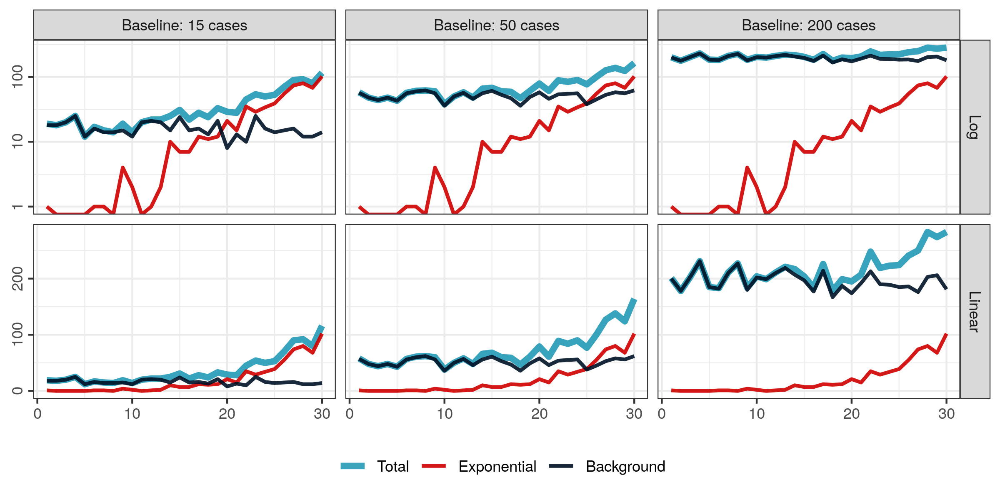
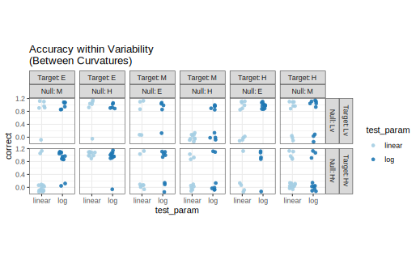
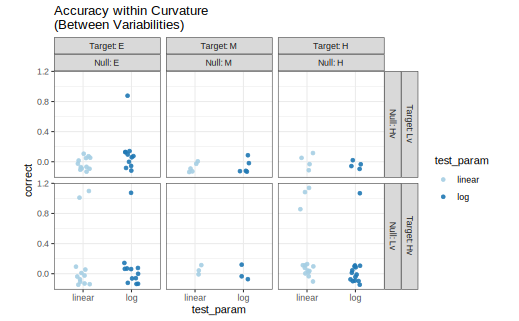
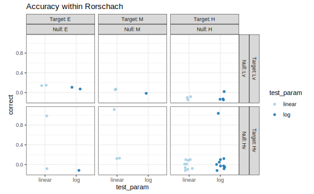

```{r, include = F, eval = T}
knitr::opts_chunk$set(echo = F, dpi = 300, message = F, warning = F, cache = T)
options(htmltools.dir.version = FALSE)
library(emo)
library(purrr)
library(tidyverse)
library(gridExtra)
library(nullabor)
library(scales)
library(knitr)
```

```{r, include = F, eval = T, cache = F}
clean_file_name <- function(x) {
  basename(x) %>% str_remove("\\..*?$") %>% str_remove_all("[^[A-z0-9_]]")
}
img_modal <- function(src, alt = "", id = clean_file_name(src), other = "") {
  
  other_arg <- paste0("'", as.character(other), "'") %>%
    paste(names(other), ., sep = "=") %>%
    paste(collapse = " ")
  
  js <- glue::glue("<script>
        /* Get the modal*/
          var modal{id} = document.getElementById('modal{id}');
        /* Get the image and insert it inside the modal - use its 'alt' text as a caption*/
          var img{id} = document.getElementById('img{id}');
          var modalImg{id} = document.getElementById('imgmodal{id}');
          var captionText{id} = document.getElementById('caption{id}');
          img{id}.onclick = function(){{
            modal{id}.style.display = 'block';
            modalImg{id}.src = this.src;
            captionText{id}.innerHTML = this.alt;
          }}
          /* When the user clicks on the modalImg, close it*/
          modalImg{id}.onclick = function() {{
            modal{id}.style.display = 'none';
          }}
</script>")
  
  html <- glue::glue(
     " <!-- Trigger the Modal -->

<!-- The Modal -->
<div id='modal{id}' class='modal'>
  <!-- Modal Content (The Image) -->
  
  <!-- Modal Caption (Image Text) -->
  <div id='caption{id}' class='modal-caption'></div>
</div>
"
  )
  write(js, file = "js-addins.html", append = T)
  return(html)
}
# Clean the file out at the start of the compilation
write("", file = "js-addins.html")
```

class:inverse
## Outline

1. Introduction to Visual Inference

2. Test Experimental Task *(Participation)*

3. Experimental Task Feedback

4. Motivation

5. Future Experimental Tasks

6. Data Generation & Simulation

7. Parameter Selection & Experimental Design

8. Preliminary Results

???
Thank you for joining in seminar today! I will be presenting on some of the early research I have been working on with Dr. Susan VanderPlas and Dr. Reka Howard regarding the perception of exponentially increasing data displayed on the log scale.

In this presentation, I will provide an introduction to visual inference, then have you participate in the visual inference study we are working on and provide any feedback. I will then share about the development process of the study including the model generation, simulation, parameter selection, and experimental design. Lastly, I will share some of the preliminary results we are seeing from the pilot study so far.

---
class:inverse
<br>
<br>
<br>
<br>
<br>
<br>
<br>
.center[
## Introduction to Visual Inference
]
???
So the first question you might have is, "what is visual inference?"

---
class:primary
## Introduction to Visual Inference
When doing exploratory data anlysis, how do we know if what we see is actually there?

```{r, echo = F, fig.width = 6, fig.height = 9/2, out.width = "80%", fig.align='center'}
data(banknote, package = "mclust")
ggplot(banknote) + 
  geom_jitter(aes(x = Left, y = Right, color = Status)) + 
  coord_fixed() + 
  theme_bw() +
  theme(axis.text = element_blank())
```

<font size="3">
.small[
Material Source: https://srvanderplas.netlify.app/talk/2019-09-05-the-power-of-visual-inference/
]
</font>

???
Typically, one of the first steps of a statisical analysis involves exploratory data analysis. I know at the consulting desk, the first thing I do when I recieve new data from a client is to generate some raw data plots. This usually guides discussions with the clients about what might be going on. For example, here, there appears to be some separation between the two groups. However, how do we know if what we are seeing is actually there?

---
class:primary
## Introduction to Visual Inference
Embed the true plot in a lineup of randomly permuted datasets.

```{r, echo = F, fig.width = 8, fig.height = 6, out.width = "80%", fig.align='center'}
library(nullabor)
lineup(null_permute("Status"), banknote, pos = 8) %>%
ggplot() + 
  geom_jitter(aes(x = Left, y = Right, color = Status), shape = 1) + 
  facet_wrap(~.sample) + 
  coord_fixed() + 
  theme_bw() +
  theme(axis.text = element_blank())
```

<font size="3">
.small[
Material Source: https://srvanderplas.netlify.app/talk/2019-09-05-the-power-of-visual-inference/
]
</font>

???

One way of answering this question is to embed the true data plot (called target plot) into a set of randomly permuted datasets (called null plots). This is what we call a lineup.

Fun fact: the term lineup comes from the law-enforcement procedure to line up a suspect among a set of innocents to check if a victim can identify the suspect as the perpetrator of the crime.

---
class:primary
## Introduction to Visual Inference

.center[

]
<font size="3">
.small[
Image Source: 

Buja, A., Cook, D., Hofmann, H., Lawrence, M., Lee, E. K., Swayne, D. F., & Wickham, H. (2009). Statistical inference for exploratory data analysis and model diagnostics. Philosophical Transactions of the Royal Society A: Mathematical, Physical and Engineering Sciences, 367(1906), 4361-4383.
]
</font>

???
The main idea behind visual inference is that the plots are visual statistics or summaries of the datasets generated by mathematical functions. In a standard statistical analysis, a test statistic is generated from the dataset and compared to the null distribution of that test statistic. Similarly, the visual statistic (target plot) is compared by a human viewer to other plots generated under the assumption of the null.


---
class:primary
## Introduction to Visual Inference

- Visual test statistic: A function of a sample that produces a plot

- $T(y)$ maps the actual data to the plot

- $T(y_0)$ maps a sample from the null distribution into the same plot form

A **lineup** usually consists of $m-1$ null plots $T(y_0)$ and one data plot (target) $T(y)$
<br>
<br>
<br>
<br>
<br>
<br>
<br>
<br>
<br>
<br>
<br>
<br>
<br>
<br>
<font size="3">
.small[
Material Source: https://srvanderplas.netlify.app/talk/2019-09-05-the-power-of-visual-inference/
]
<font>

???
So what we have is a visual test statistic which is a function that maps a dataset to a plot. We have our observed test statistic, T(y), which maps the actual data to the desired plot and our T(y_not) which maps a dataset generated under the null distribution (for example: by a randomization permutation) into that same plot.

A lineup usually consists of m-1 null plots and 1 target plot.

---
class:primary
## Why Visual Inference?

- Visual tests are more comprehensive.

- Individuals are asked to select one or more plots from the lineup which are “different." 

    - Specific type of difference is left unspecified. 
    
- A visual test might evaluate several simultaneous characteristics of a plot

    - Equivalent numerical assessment may involve multiple tests using different test statistics.
    
<br>
<br>
<br>
<br>
<br>
<br>
<br>
<br>
<br>
<br>
<font size="3">
.small[
Source: https://github.com/srvanderplas/visual-inference-alpha
]
<font>
???
The main benefit of using visual inference is that visual tests tend to be more comprehensive. Since individuals are being asked to select one or more plots from a the lineup which are different but the difference is left unspecified the individual eye is actually spotting many differences at once. An equavalent numerical assesment may involved multiple tests using different test statistics. 

---
class:inverse
<br>
<br>
<br>
<br>
<br>
<br>
<br>
.center[
# Types of Lineups
]
???

Now I am going to share a few different types of lineups using some fun pictures of dogs. I know we have all become comfortable sitting on zoom on mute, but this part will require some participation where you might have to unmute yourself.

---

class:primary
## Types of Lineups
.right-column[
.center[

<font size="2">
.small[
Image Source: http://srvanderplas.github.io/Presentations/JSM2019/#p1
]
</font>
]
]

???
In this first example, which panel is different?

--

.left-column[
<br>
<br>
<br>
**Null Lineups (aka Rorschach Lineups)**

Consists entirely of null plots

]

???

Actually, this plot does not contain a target panel. We call this a null lineup where all of the plots are drawn from the same null distribution. For this lineup example, the dogs aren't all the same, but it consists of 20 Komondor dog pictures. 
A null lineup is called a Rorschach lineup which was named after the ink-blot test used in psychoanalysis. 

Rorschach plots are useful in the analysis part of a visual inference experiment by providing information about how often certain panels are selected.

---
class:primary
## Types of Lineups

.right-column[
.center[

<font size="2">
.small[
Image Source: http://srvanderplas.github.io/Presentations/JSM2019/#p1
]
</font>
]
]
???

Now in this lineup, which panel is different?

Most of you spotted the cat in panel 7.

--

.left-column[
<br>
<br>
<br>
**Standard Lineup**

One Target Plot

]
???

This is a standard lineup containing one target plot.

---
class:primary
## Types of Lineups
.right-column[
.center[

<font size="2">
.small[
Image Source: http://srvanderplas.github.io/Presentations/JSM2019/#p1
]
</font>
]
]
???
And in our last example, which panel is different?

Most of you again spotted the cat in panel 14, but did anyone see the fox in panel 13?

--

.left-column[
<br>
<br>
<br>
**Two-Target Lineup**

Head-to-head comparisons of two models

Null plots from a third and/or mixture distribution.

]
--

???

This is called a two-target lineup. The goal is to make head-to-head comparisons in order to determine which target is more visually salient. Here, we have dogs for the null plots, and a fox and a cat for the two different "models". The cat is quite a bit more salient than the fox.

---
class:primary
## Analyzing Lineup Data

- In most visual inference experiments, each lineup is evaluated by multiple individuals.

- **Simplistic base idea:** The target plot is selected more often than you would expect.
    
    - Results are aggregated to generate a visual p-value using a Binomial model. (Majumder, Hofmann, and Cook, 2013).

- **Complication:** Dependencies in the design of most visual inference experiments resulting from repeated evaluations of the same lineup.

    - Visual p-values are calculated using a Dirichlet-multinomial distribution to model the probabilities of selecting each panel and the observed participant selections.

<br>
<br>
<br>
<br>
<br>
<font size="3">
.small[
Source: https://github.com/srvanderplas/visual-inference-alpha
]
<font>

???

In most studies, each lineup is evaluated by multiple individuals.

The main idea behind a visual inference experiment is that if the target panel is selected more often than expected, you would claim to have significant evidence. This would follow a binomial model. 

However, a complication arrises as the probability of selecting each panel is not the equal.

Susan has been working on a paper regarding how to analyze lineup data by modeling the dependencies of this data by using visual p-values which are calculated using a Dirichlet-multinomial distribution. This models the probabilities of selecting each panel.

---
class:inverse
<br>
<br>
<br>
<br>
<br>
<br>
<br>
.center[
## Test Experimental Task (~10 Minutes)
]

???
Next, I am going to give everyone 10 minutes to participate in the visual inference experiment we have been devleoping. And because I don't want to sit here in silence, I will be playing jepordy music in the background so feel free to mute me :)

Play jepordy music (https://www.youtube.com/watch?v=IkdmOVejUlI).

---
class:primary
## Test Experimental Task
.pull-left[
- **Goal:** Test out an experiment designed to assess perceptual and cognitive biases in graphical displays of exponentially increasing data.

- Vist **https://bit.ly/2E7bU9l** and follow the Reddit link to complete the experimental task.

].pull-right[

]
<br>
<br>
<br>
<br>
<br>
<br>
<br>
<br>
<br>
<font size="2">
.small[
Source: https://dribbble.com/shots/5588147-Hamster-Wheel
]
</font>

???
The goal of this is to test out an experiment designed to asses perceptual and cognitive biases in graphical displays of exponentially increasing data. We are in the development stages so we want to catch any glitches in the study early on.

Visit the bitly link or click on the link I just sent in the chat. This will take you to a reddit page where you will follow that link to the shiny server to participate.

I am going to set a timer for 10 minutes, so if you do not complete the entire task, that is alright.


Okay so 10 minutes is up so I am going to continue on with the presentation. You can either stop the study where you are as we have that data collected now, continue and half listen, or go back to complete the study (but also the rest of this presentation might bias you if you do that).

---
class:primary
## Lineup Experimental Task Feedback `r emo::ji("thumbsup")` `r emo::ji("thumbsdown")`

- What worked well? What didn't work well?

- What features were you using to differentiate plots?

- What do you think the null hypothesis was?

- Any suggestions for adjustments?

.center[
```{r results='asis', echo = F, include = T, cache = F, eval = TRUE}
i1 <- img_modal(src = "images/linear-lineup-example.png", alt = " ", other=list(width="45%"))
i2 <- img_modal(src = "images/log-lineup-example.png", alt = " ", other=list(width="45%"))

c(str_split(i1, "\\n", simplify = T)[1:2],
  str_split(i2, "\\n", simplify = T)[1:2],
  str_split(i1, "\\n", simplify = T)[3:9],
  str_split(i2, "\\n", simplify = T)[3:9]
  ) %>% paste(collapse = "\n") %>% cat()
```
]

???
For those of you who were able to participate in the study. I would appreciate any feedback you have.

---
class:inverse
<br>
<br>
<br>
<br>
<br>
<br>
<br>
.center[
## Motivation & Experiment Goals
]

???
Now that you have participated in the study, I am going to share a little bit about the motivation behind the study and how the experimental task was developed. 

---
class:primary
## Motivation

- Log scales are often used to display data over several orders of magnitude within one graph.

- During the COVID pandemic, we've seen both the benefits and the pitfalls of using log scales to display data. 

.center[

]
<font size="2">
.small[
Image Source: http://srvanderplas.github.io/Presentations/2020-DSSV/index_files/figure-html/unnamed-chunk-7-1.png
]
</font>

???

This summer, Susan and I began collecting and evaluating some of the COVID graphics. Many of the dashboards displayed case count data on the log scale which has both benefits and pitfalls. This led us down a rabbit hole of searching for literature about how logrithmic scales are used in a variety of disciplines.

---
class:primary
## Future Experimental Tasks

**Big Idea:** Are there benefits to displaying exponentially increasing data on a log scale rather than a linear scale?

--
1. Lineup `r emo::ji("chart increasing")` `r emo::ji("chart increasing")` `r emo::ji("chart increasing")`

    - Test an individuals ability to perceptually differentiate exponentially increasing data with differing rates of change on both the linear and log scale.
    
???

The first part of the study is what you just participated in as the lineups. The goal of this is to test an individuals ability to perceptually differentiate exponentially increasing data with differing rates of change on both the linear and log scale.

--

2. You Draw It `r emo::ji("pencil2")`
    
    - Tests an individuals ability to make predictions for exponentially increasing data.
    
    - Based off NYT "You Draw It" [**EXAMPLE**](https://www.nytimes.com/interactive/2017/01/15/us/politics/you-draw-obama-legacy.html?searchResultPosition=8) 

???
The second task is what we are calling You Draw It. The goal of this task is to test an individuals ability to make predictions for exponentially increasing data.

This is similar to a previous paper, Eye Fitting Straight Lines, which explored properties of lines fitted by eye. Previous literature suggests that we tend to underestimate predictions of exponentially increasing data.

The idea for this task was inspired by the New York Times "You Draw It" page which is fun to check out. 

--
3. Estimation `r emo::ji("straight_ruler")`

    - Tests an individuals ability to translate a graph of exponentially increasing data into real value quantities.

???
The last task that is going to be a part of the study is an estimation task. This tests an individuals ability to translate a graph of exponentially increasing data into real value quantities. We then ask individuals to extend their estimates by making comparisons across levels of the independent variable.

--
<br>
.center[
See sample experimental task applet at **https://bit.ly/2E8Zqht**
]
???
Here is an example of each of the experimental tasks as submitted in our IRB.

---
class:inverse
<br>
<br>
<br>
<br>
<br>
<br>
<br>
.center[
## Model Generation & Simulation
]
???
As we began developing this study, we explored various models used to simulate the data used in the study.

---
class:primary
## Data Generation Models

.pull-left[
**Two Parameter Exponential**
$$y=\alpha e^{\beta x}$$

```{r results='asis', echo = F, include = T, cache = F, eval = TRUE}
i1 <- img_modal(src = "images/two-coef-model.png", alt = " ", other=list(width="100%"))

c(str_split(i1, "\\n", simplify = T)[1:2],
  str_split(i1, "\\n", simplify = T)[3:9]
  ) %>% paste(collapse = "\n") %>% cat()
```

- Different starting values
- Same ending value
- Linear lines on log scale
].pull-right[
**Three Parameter Exponential**
$$y=\alpha e^{\beta x} + \theta$$

```{r results='asis', echo = F, include = T, cache = F, eval = TRUE}
i1 <- img_modal(src = "images/three-coef-model.png", alt = " ", other=list(width="100%"))
c(str_split(i1, "\\n", simplify = T)[1:2],
  str_split(i1, "\\n", simplify = T)[3:9]
  ) %>% paste(collapse = "\n") %>% cat()
```

- Same starting and ending value
- Curvature happens on log scale
]

Normally distributed errors are then added to the selected model:
1. Multiplicative
2. Additive

???
We explored two different generation models: a two parameter exponential model or a three paramter exponential model. 

In the two parameter exponential model we can see that we would have different starting values but the same ending values (based on what we set alpha to) and that the log scale data follows a linear line (taking the log of an exponential). 

However, in the three parameter exponential model, we are able to attain the same starting and ending values, but sacrifice this resulting in some curvature on the log scale as well. 

Lastly, we have the two options of either multiplicative error or additive error added on top of our selected data generation model.

---
class:primary
## Heuristic Simulation Approach

1. Set 3 points (Min, Max, Midpoint)
2. Select starting values
  - Obtain linear model coefficients for $\log(y_i) = a+bx_i$
	- $\alpha_0 = e^a$
	- $\beta_0 = b$
	- $\theta_0 = \frac{\min(y)}{2}$
3. Using `nls()`, fit selected model to the points and obtain parameter estimates.
$$y_i = \hat\alpha e^{\hat\beta x_i} + \hat\theta$$
4. Using the parameter estimates, assume $\epsilon_i \sim N(0, \sigma^2)$ and set $\tilde \alpha = \frac{\hat\alpha}{e^{\sigma^2/2}}$. Simulate data based on $y_i = \tilde\alpha e^{\hat\beta x_i + \epsilon_i}+\hat\theta.$
.center[
```{r results='asis', echo = F, include = T, cache = F, eval = TRUE}
i1 <- img_modal(src = "images/heuristic-simulation.png", alt = " ", other=list(width="50%"))

c(str_split(i1, "\\n", simplify = T)[1:2],
  str_split(i1, "\\n", simplify = T)[3:9]
  ) %>% paste(collapse = "\n") %>% cat()
```
]


???
The simulation approach we selected to use was what we are calling a heuristic simulation. By this, what I mean is we selected a minimum and maximum value and then a midpoint that falls on a given line.

From there, we obtained starting values and fit a nonlinear model to obtain our final parameter estimates. 

When using the multiplicative error, we will have some nonconstant variance so to gaurantee that the expected value is equal for different error variances, we then scale our final alpha.

All of this could be done algebraically as well, but we found that using the heuristic simulation approach seemed to be more subtle in the different starting values of the two-parameter exponential model and the curvature happening on the log scale in the three-parameter exponential model. 

---
class:inverse
<br>
<br>
<br>
<br>
<br>
<br>
<br>
.center[
## Parameter Selection & Study Design
]
???
Once we selected the generation model and simulation approach, we needed to select the parameters.

---
class:primary
## The 'Goldilocks Zone'

The **Lack of Fit** test statistic calculated by the deviation of the data from a linear regression line was used to determine the curvature and variability combination values.

.pull-left[
**Curvature**
- Controled by the `Midpoint` in the heuristic simulation and in turn affects $\hat\beta.$
- Easy / Medium / Hard

**Variability**
- Controled by the standard deviation, $\sigma$, of the errors.
- Low / High

].pull-right[
```{r results='asis', echo = F, include = T, cache = F, eval = TRUE}
i1 <- img_modal(src = "images/lof-curvature.png", alt = " ", other=list(width="100%"))

c(str_split(i1, "\\n", simplify = T)[1:2],
  str_split(i1, "\\n", simplify = T)[3:9]
  ) %>% paste(collapse = "\n") %>% cat()
```

```{r results='asis', echo = F, include = T, cache = F, eval = TRUE}
i2 <- img_modal(src = "images/lof-variability.png", alt = " ", other=list(width="100%"))

c(str_split(i2, "\\n", simplify = T)[1:2],
  str_split(i2, "\\n", simplify = T)[3:9]
  ) %>% paste(collapse = "\n") %>% cat()
```
]

???
The two features we decided to manipulate are the curvature and variability. A previous study examined whether discrimination between curvature types is possible and found that accuracy was higher when nonlinear trends were presented and that accuracy was higher with low variability.

We decided to select 3 levels of curvature and 2 levels of variability.

Curvature is controled by that midpoint and in turn the beta parameter and the variability is controled by the error standard deviation.

In order to determine whether the levels of curvature and variability differ, we calculated the lack of fit statistic as the deviation of the simulated data from a linear regression line. From here, we simulated 1000 datasets and calculated the lack of fit statistic and look for separation in the density plots.

The goal is to hit that sweet spot of it not being too easy to pick out the target plot but also not too difficult. 

---
## Study Design

**Treatment Design:** Target Panel gets model A and Null Panels get model B

$3!\cdot 2!= 6$ panel comboinations of curvature $\times 2$ levels of variability $= 12$

$2!\cdot 1!= 2$ panel combinations of variability $\times 3$ levels of curvature $=6$

$= 18$ test parameter combinations

$3 \times 2 = 6$ rorschach parameter combinations

$= 24$ parameter combinations

$\times 2$ lineup datasets per parameter combination $=$ **48 datasets**


$\times 2$ scales (log & linear) $=$ **96 different lineups.**

--

<hr>

**Experimental Design:** Split plot with an IBD for the whole plot factor

$9$ test parameter combinations per participant $\times 2$ scales $= 18$ test lineups

$1$ rorschach parameter combination per participant $\times 2$ scales $= 2$ rorschach lineups

$=$ **20 lineup plots per participant**

---
class:inverse
<br>
<br>
<br>
<br>
<br>
<br>
<br>
.center[
## Preliminary Results
]

???
We are currently collecting pilot study data to catch any glitches and determine how effective our parameter selections are. We have not run any formal models on the pilot data yet, but I have a few raw data plots showing some of the trends we are currently seeing.

---
class:primary
## Preliminary Results: Effect of Curvature
.center[

]

???
Here we are seeing the results of comparing the effect of curvature within the levels of variability.

What we see along the top is the curvature level of the target plot embeded in a set of null plots with curvature levels indicated along the right side. Our variability levels are indicated by the color. 

From here, we have reason to beleive that presenting data on a log scale might have an effect when working with curvature levels closer to each other (for example a lot of curvature embeded in medium curvature). 

We are also seeing that within lower variabilities, the accuracy tends to be higher than the accuracy within higher variabilities. This is supported by previous literature.

We are also seeing a potential for there being an effect of whether the target has more curvature than the null or not. For example in the bottom left here, we see a target plot with a lot of curvature embeded in null plots that are close to linear is easier to detect than a target plot close to a straight line embeded within null plots with lots of curvature. This also follows from previous literature which suggests that it is easy to say something is not linear than it is to say that something is linear.

---
class:primary
## Preliminary Results: Effect of Variability
.center[

]

???
Here we are comparing the effect of variability within the levels of curvature, again, along the top we are indicating the variability level of the target plot embeded in the a set of null plots with the variability indicated on the right. The levels of curvature are indicated by the 3 colors. Overall, we can see it is actually very difficult to pick out the target plot. We are maybe seeing that it is possible to detect a target plot with higher variability than it is to detect a target plot with lower variability, but even that appears to be difficult. This is a benefit of running pilot studies since we can narrow in on the parameter combinations that are important to include in our final study.

---
class:primary
## Preliminary Results: Rorschach
.center[

]

???
Lastly, we can see in the rorschach plots (basically a guessing game) has very low accuracy. Recall that these plots will be used in the future visual inference analysis to estimate the effect of panels not all being selected with equal probabilities.

---
class:primary
## References
```{r, load_refs, echo=FALSE}
library(RefManageR)
bib <- ReadBib("references.bib", check = FALSE)
ui <- "- "
```
<font size="2">
.small[
```{r, print_refs, results='asis', echo=FALSE, warning=FALSE, message=FALSE}
print(bib[key = c("best_perception_2007", "wagenaar_misperception_1975", "menge_logarithmic_2018", "sevi_logarithmic_2020","buja_statistical_2009", "friel_making_2001")], 
  .opts = list(check.entries = FALSE, 
               style = "html", 
               bib.style = "authoryear"))
```
]
</font>

---
class:inverse
<br>
<br>
<br>
<br>
<br>
<br>
<br>
<br>
<br>
.center[
# Questions?
]

???

Thank you for listening to some of the research I have been working on and participating in the pilot study. Feel free to send the reddit link to anyone you think may be interested in taking it.

If you are interested in learning more about how visual inference is used, I beleive the seminar in a couple weeks is going to be about using visual inference in teaching introductory statistics courses. 

Does anyone have questions and/or feedback?

---
class:primary
## The 'Goldilocks Zone'

.center[
```{r results='asis', echo = F, include = T, cache = F, eval = TRUE}
i2 <- img_modal(src = "images/linear-sim-plot.png", alt = " ", other=list(width="70%"))

c(str_split(i2, "\\n", simplify = T)[1:2],
  str_split(i2, "\\n", simplify = T)[3:9]
  ) %>% paste(collapse = "\n") %>% cat()
```

```{r results='asis', echo = F, include = T, cache = F, eval = TRUE}
i2 <- img_modal(src = "images/log-sim-plot.png", alt = " ", other=list(width="70%"))

c(str_split(i2, "\\n", simplify = T)[1:2],
  str_split(i2, "\\n", simplify = T)[3:9]
  ) %>% paste(collapse = "\n") %>% cat()
```
]

---
class:primary
## Parameter Values

```{r, parameterselection, eval=T, echo = F}
xMid_vals  <- c(14.5, 13, 11.5)
sigma_vals <- c(0.25, 0.37, 0.12, 0.18, 0.05, 0.07)

yRange_vals = c(10,100)

coefEst <- function(xMid, xRange = c(0,20), yRange = yRange_vals){
  
  # This creates the line y = -x (scaled to fit the x and y ranges)
  # |*            0
  # |  *
  # |    *
  # |      *
  # |        1
  # |          2
  # |0___________3
  #
  # where 1, 2, 3 represent different points used to determine the line curvature
  
  lineData   <- tibble(xLine = seq(xRange[1],xRange[2],0.1),
                       yLine = -(abs(diff(yRange))/abs(diff(xRange)))*(xLine-xRange[1])+yRange[2])
  pointsData <- tibble(xPoint = c(xRange[1], (xMid-0.1), (xMid+0.1), xRange[2]),
                       yPoint = c(yRange[1], lineData$yLine[lineData$xLine == xMid], lineData$yLine[lineData$xLine == xMid], yRange[2]))
  
  # Connecting the 0 points in the illustration above with the 3rd point that
  # determines curvature gives us a set of 3 points to use to fit an exponential
  # line to the data.
  
  # We fit a linear regression to the log-transformed data to get starting values
  lm.fit <- lm(log(yPoint) ~ xPoint, data = pointsData)
  
  alpha.0  <- exp(coef(lm.fit)[1]) %>% as.numeric()
  beta.0   <- coef(lm.fit)[2] %>% as.numeric()
  theta.0 <- min(pointsData$yPoint) * 0.5  # Why 0.5?
  
  # and then use NLS to fit a better line to the data
  start <- list(alpha = alpha.0, beta = beta.0, theta = theta.0)
  nonlinear.fit   <- nls(yPoint ~ alpha * exp(beta * xPoint) + theta ,
                         data = pointsData, start = start)
  
  coefficients <- tibble(alphahat = (coef(nonlinear.fit)[1] %>% as.numeric()),
                         betahat  = coef(nonlinear.fit)[2] %>% as.numeric(),
                         thetahat = coef(nonlinear.fit)[3] %>% as.numeric())
  
  return(coefficients)
}


coefData <- tibble(xMid = xMid_vals) %>%
  mutate(coefficients = pmap(list(xMid),coefEst)) %>%
  unnest(coefficients)

#Identify parameters
parmData <- tibble(Curvature   = c("Easy", "Easy", "Medium", "Medium", "Hard", "Hard"),
                   Variability = c("Low", "High", "Low", "High", "Low", "High"),
                   xMid        = c(rep(xMid_vals[1],2), rep(xMid_vals[2],2), rep(xMid_vals[3],2)),
                   sigma       = sigma_vals) %>%
  left_join(coefData, by = "xMid")

knitr::kable(parmData, 'html', digits = 3)
```

<br>

```{r parameterselection2, eval=T, echo = F}
options(knitr.kable.NA = '')
knitr::kable(rbind(Domain = c(0,20),
             Range = c(10,100),
             N = c(50, NA)), "html")
```
