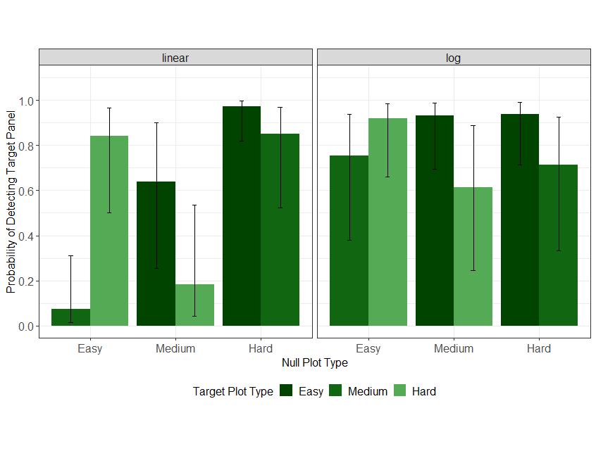
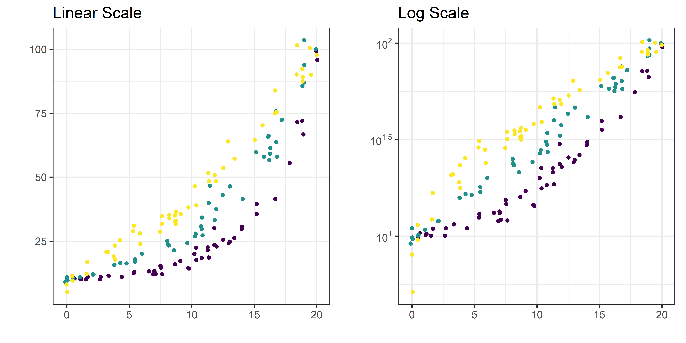

```{r, include = F, eval = T}
knitr::opts_chunk$set(echo = F, dpi = 300, message = F, warning = F, cache = T)
options(htmltools.dir.version = FALSE)
library(emo)
library(purrr)
library(tidyverse)
library(gridExtra)
library(nullabor)
library(scales)
library(knitr)
library(kableExtra)
library(RefManageR)
bib <- ReadBib("references.bib", check = FALSE)
ui <- "- "
options(knitr.kable.NA = '')
```

```{r, include = F, eval = T, cache = F}
clean_file_name <- function(x) {
  basename(x) %>% str_remove("\\..*?$") %>% str_remove_all("[^[A-z0-9_]]")
}
img_modal <- function(src, alt = "", id = clean_file_name(src), other = "") {
  
  other_arg <- paste0("'", as.character(other), "'") %>%
    paste(names(other), ., sep = "=") %>%
    paste(collapse = " ")
  
  js <- glue::glue("<script>
        /* Get the modal*/
          var modal{id} = document.getElementById('modal{id}');
        /* Get the image and insert it inside the modal - use its 'alt' text as a caption*/
          var img{id} = document.getElementById('img{id}');
          var modalImg{id} = document.getElementById('imgmodal{id}');
          var captionText{id} = document.getElementById('caption{id}');
          img{id}.onclick = function(){{
            modal{id}.style.display = 'block';
            modalImg{id}.src = this.src;
            captionText{id}.innerHTML = this.alt;
          }}
          /* When the user clicks on the modalImg, close it*/
          modalImg{id}.onclick = function() {{
            modal{id}.style.display = 'none';
          }}
</script>")
  
  html <- glue::glue(
     " <!-- Trigger the Modal -->

<!-- The Modal -->
<div id='modal{id}' class='modal'>
  <!-- Modal Content (The Image) -->
  
  <!-- Modal Caption (Image Text) -->
  <div id='caption{id}' class='modal-caption'></div>
</div>
"
  )
  write(js, file = "js-addins.html", append = T)
  return(html)
}
# Clean the file out at the start of the compilation
write("", file = "js-addins.html")
```

class:primary
## Motivation

- Graphics have become front and center during the covid pandemic. They have been used to display case counts, transmission rates, and outbreak regions `r Citep(bib[[c("lisa_charlotte_2020", "romano_scale_2020", "rost_2020")]])`.

- These graphics helped guide decision makers and facilitated communication with the public to increase compliance `r Citep(bib[["bavel_using_2020"]])`.

- Some graphics have utilized log scales to display case counts `r Citep(bib[["wade_fagen_ulmschneider_2020"]])`. There are both benefits and pitfalls to this design decision.

- Influenced our main research question: "Are there benefits to displaying exponentially increasing data on a log scale rather than a linear scale?"

???

Thank you for coming today. I will be presenting the results from a graphics experiment Susan, Reka, and I conducted regarding the perception of displaying exponentially increasing data on a log scale. This will be familair to someo of you who participated as our guinea pigs for this experiement last fall, but hopefully you find some of the results interesting.

During the covid pandemic, we have seen a large influx of data visualizations displaying case counts, transmission rates, and outbreak regions. With a need for information, the general public began seeking out graphical displays of coronavirus data in mass media providing increased and ongoing exposure to these graphics over time. Many of these graphics helped guide decision makers to implement policies such as shut-downs or mandated mask wearing, as well as facilitated communication with the public to increase compliance.

Many graphics such as the Financial Times provided the option of displaying case counts on both the log and linear scale. From this experience we have seen both the benefits and pitfalls of this design choice. For example, during the early stages of the coronavirus pandemic, there was a large magnitude discrepancy at a given time between different geographic regions. During this time, we saw the usefulness of log-scales showing case count curves for areas with few cases and areas with many cases within one chart. As the pandemic has evolved, and the case counts were no longer spreading exponentially, graphs with linear scales seemed more effective at spotting early increases in case counts that signaled more localized outbreaks.

This influenced our main research question: Are there benefits to displaying exponentially increasing data on a log scale rather than a linear scale?

---
class:primary
## Prior Literature

- Log scale transformations are a common solution to displaying data over several orders of magnitude within one graph `r Citep(bib[["menge_logarithmic_2018"]])`.

- Our perception and mapping of numbers to a number line is logarithmic at first, but transitions to a linear scale later in development, with formal
mathematics education `r Citep(bib[[c("varshney_why_2013", "siegler_numerical_2017", "dehaeneLogLinearDistinct2008")]])`

- Estimation and prediction of exponential growth tends to be underestimated when presented both numerically and graphically `r Citep(bib[[c("wagenaarMisperceptionExponentialGrowth1975")]])`. This could be addressed by log-transforming the data, however, this introduces new complexities.

- In `r Citet(bib[[c("best_perception_2007")]])`, the authors explored whether discrimination between curve types is possible. They found that accuracy is higher when nonlinear trends presented (e.g. it's hard to say something is linear, but easy to say that it isn't) and that accuracy is higher with low additive variability.


???

When data spans several orders of magnitude, a design choice is made to show the data on its original scale (compressing the smaller magnitudes into relatively little area) or to transform the scale and alter the appreance of the data. Log scale transformations are a common solution to this. Logarithms make multiplicative relationships additive showing elasticities and other proportional changes. 

Research suggests our perception and mapping of numbers to a number line is logarithmic at first, but transitions to a linear scale later in development after formal education has taken place. It is a natural assumption that if we percieve logarithmically by default that display information on a log scale should be easy to read and understand/use.

Many early studies have explored the estimation and prediction of expoential groth, finding that growth is underestimated. Log transformations might be a way to address this, however most readers are not familar enough with mathematical concepts to intuitively understand logarithmic math and translate that back into real-world interpretations.

A study that aligns closely with our early findings is Best et. al 2007. This sudy explored whether discrimination between curve types is possible and found that accuracy is higher when nonlinear trends were presented (i.e. it's hard to say something is linear, but easy to say that it isn't) and that accuracy is higher with low additive variability.

---
## Overarching Goal

Provide a set of principles to guide design choices in order to ensure that charts are effective `r Citep(bib[[c("unwin_why_2020")]])`.

**Big Idea:** Are there benefits to displaying exponentially increasing data on a log scale rather than a linear scale?
    
Evaluate design choices through the use of graphical tests. Could ask participants to:

- **identify differences in graphs.**
- read information off of a chart accurately.
- use data to make correct real-world decisions.
- predict the next few observations.

Use visual inference and statistical lineups to test our ability to differentiate between exponentially increasing curves with differing growth rates, using linear and log scales `r Citep(bib[[c("vanderplas_clusters_2017", "hofmann_graphical_2012", "loyVariationsQQPlots2016")]])`.

???
The overarching goal of this research is to design and carry out experimental taks that provide a set of principles to guide design choices in order to ensure that charts are effective. So far, we will be focusing on this first graphical test and asking participants to identify differences in graphs. This is the most fundamental task and does not require that participants understand exponential growth, identify log scales, or have any mathematical training. Basically, we are testing the change in perceptual sensitivity resulting from visualization choices. To do this, we will be utilizing visual inference and statistical lineups.

---
class:primary
## Visual Inference with Lineups

- Visual test statistic: A function of a sample that produces a plot

- $T(y)$ maps the actual data to the plot

- $T(y_0)$ maps a sample from the null distribution into the same plot form

A **lineup** usually consists of 19 null plots $T(y_0)$ and 1 data plot (target) $T(y)$

.center[
```{r results='asis', echo = F, include = T, cache = F, eval = TRUE}
i1 <- img_modal(src = "images/linear-lineup-example.png", alt = " ", other=list(width="45%"))
i2 <- img_modal(src = "images/log-lineup-example.png", alt = " ", other=list(width="45%"))

c(str_split(i1, "\\n", simplify = T)[1:2],
  str_split(i2, "\\n", simplify = T)[1:2],
  str_split(i1, "\\n", simplify = T)[3:9],
  str_split(i2, "\\n", simplify = T)[3:9]
  ) %>% paste(collapse = "\n") %>% cat()
```
]
<font size="2">
.small[
Material Source: https://srvanderplas.netlify.app/talk/2019-09-05-the-power-of-visual-inference/
]
<font>

???

The main idea behind visual inference is that graphs are visual statistics or summaries of the data sets generated by mathematical functions. In a standard statistical analysis, a test statistic is generated from the dataset and compared to the null distribution of that test statistic. Similarly, the visual statistic (target plot) is compared by a human viewer to other plots generated under the assumption of the null.

So what we have is a visual test statistic which is a function that maps a data set to a plot. We have our observed test statistic, T(y), which maps the actual data to the desired plot and our T(y_not) which maps a dataset generated under the null distribution (for example: by a randomization permutation) into that same plot.

Our lineups followed the typical suggestion of consisting of 19 null plots and 1 target plot which comes from a 5% chance of selecting the target plot by random chance.

Here we see a couple examples of lineups used in our current study. Can you pick out the target panel on the left? How about the right?

---
class:primary
## Data Generation

.pull-left[
**Three Parameter Exponential:** $y_i=\alpha e^{\beta x_i + \epsilon_i} + \theta$ with $\epsilon_i \sim N(0, \sigma^2)$

**Heuristic Simulation Approach**
- Set 3 points (Min, Max, Midpoint)
- Select starting values
  - Obtain linear model coefficients for $\log(y_i) = a+bx_i$
	- $\alpha_0 = e^a ;\beta_0 = b; \theta_0 = \frac{\min(y)}{2}$
	
].pull-right[
```{r results='asis', echo = F, include = T, cache = F, eval = TRUE}
i1 <- img_modal(src = "images/heuristic-simulation.png", alt = " ", other=list(width="100%"))
c(str_split(i1, "\\n", simplify = T)[1:2],
  str_split(i1, "\\n", simplify = T)[3:9]
  ) %>% paste(collapse = "\n") %>% cat()
```
]

- Using `nls()`, fit selected model to the points and obtain parameter estimates $y_i = \hat\alpha e^{\hat\beta x_i} + \hat\theta$.
- Using the parameter estimates, assume $\epsilon_i \sim N(0, \sigma^2)$ and set $\tilde \alpha = \frac{\hat\alpha}{e^{\sigma^2/2}}$. Simulate data based on $y_i = \tilde\alpha e^{\hat\beta x_i + \epsilon_i}+\hat\theta.$

???

The final model we selected to simulate an exponentially increasing trend was the three parameter exponential model with multiplicative errors leading to nonconstant variance. 

By doing this, we could implement constraints of the same starting and ending values so that comparisons across models with differing parameters compared. However, this results in some curvature on the log scale as well in comparison to the linear trend we would typically experience from log transforming exponetial data.

The simulation approach we selected to use was what we are calling a heuristic simulation. By this, what I mean is we selected a minimum and maximum value and then a midpoint that falls on a given line.

From there, we obtained starting values and fit a nonlinear model to obtain our final parameter estimates. 

When using the multiplicative error, we will have some nonconstant variance so to gaurantee that the expected value is equal for different error variances, we then scale our final alpha.

Using the final parameters estimates, we simulate data along that increasing exponential curve and deviate it from the curve by including our error in the exponent.

---
class:primary
## The 'Goldilocks Zone'

The **Lack of Fit** test statistic calculated by the deviation of the data from a linear regression line was used to determine the curvature and variability combination values.

.pull-left[
- **Curvature** is controled by the `Midpoint` in the heuristic simulation and in turn affects $\hat\beta.$ Three difficulty levels were selected:
    - Easy (Obvious curvature)
    - Medium  (Noticable curvature) 
    - Hard (Almost linear)
    
- $\hat\alpha$ and $\hat\theta$ are adjusted within the heutistic simulation to ensure our range and domain constraints are met.

- A sensible value for $\sigma$ was selected for each curvature difficulty.

].pull-right[
```{r results='asis', echo = F, include = T, cache = F, eval = TRUE}
i1 <- img_modal(src = "images/lof-curvature.png", alt = " ", other=list(width="100%"))

c(str_split(i1, "\\n", simplify = T)[1:2],
  str_split(i1, "\\n", simplify = T)[3:9]
  ) %>% paste(collapse = "\n") %>% cat()
```

```{r parameter-data}
parameter_data <- read.csv(file = "data/parameter_data.csv")
parameter_data %>%
  mutate(difficulty = ifelse(difficulty == "Obvious Curvature", "Easy",
                             ifelse(difficulty == "Noticable Curvature", "Medium", "Hard"))
         ) %>%
  select(difficulty, xMid, alphahat, alphatilde, betahat, thetahat, sigma_vals) %>%
  kable("html", digits = 2, escape = F, booktabs = T, linesep = "", align = "c", label = "parameter-data",
        col.names = c("",   "$x_{mid}$", "$\\hat\\alpha$", "$\\tilde\\alpha$", "$\\hat\\beta$", "$\\hat\\theta$", "$\\hat\\sigma$")) %>%
  kable_styling(font_size = 14)
```
]

???
After running an initial study where we manipulated both curvature and variability (as you participated in last fall), we decided to design the study to focus on low variability only and manipulate the curvature. Recall, a previous study examined whether discrimination between curvature types is possible and found that accuracy was higher when nonlinear trends were presented and that accuracy was higher with low variability.

We decided to select 3 levels of curvature. Curvature is controled by that midpoint and in turn the beta parameter. Alpha and Theta are calculated as a result in order to maintain our range and domain constraints. A sensible choice for sigma was then selected. 

In order to determine whether the levels of curvature differ, for each difficulty level, we simulated 1000 data sets where each x value was replicated 10 times. Then, the lack of fit statistic was computed for each simulated dataset by calculating the deviation of the data from a linear line. 

Plotting the density curves of the LOF statistics for each level of difficulty choice allows us to evaluate the ability of differentiating between the difficulty levels and thus detecting the target plot.

The goal is to hit that sweet spot of it not being too easy to pick out the target plot but also not too difficult. 


We can see the densities of each of the three difficulty levels here. 

While the lack of fit statistic provides us a numerical value for discriminating between the difficulty levels, we cannot directly relate this to the perceptual discriminability; it serves primarily as an approximation to ensure that we are testing parameters at several distinct levels of difficulty.

---
class:primary
## Study Design

**Treatment Design:** Target Panel gets model A and Null Panels get model B

$3!\cdot 2!= 6$ curvature combinations

$\times 2$ lineup data sets per combination $=$ **12 test data sets**

$\times 2$ scales (log & linear) $=$ **24 different lineup plots**

--

<hr>

**Experimental Design:**

$6$ test parameter combinations per participant $\times 2$ scales $= 12$ test lineups

$1$ rorschach parameter combination per participant

$=$ **13 lineup plots per participant**

<hr>

*Note: There are 3 parameter combinations which generate homogeneous "Rorschach" lineups (all null panels from same distribution). These evaluations
are not used in any current analyses.*

---
class:primary
## Data Collection

- Recruitted via Reddit `r/visualization` and `r/SampleSize` pages for a little over two weeks.

- Participants completed the study at https://shiny.srvanderplas.com/log-study/.

- Final dataset included a total of 41 participants and 477 lineup evaluations.

- Each plot was evaluated by between 18 and 28 individuals (Mean: 21.77, SD: 2.29). 

- In 67% of the 477 lineup evaluations, participants correctly identified the target panel.

???
Starting about mid November, we began recruitting for the current run of this experiment. In total we had 58 individuals completed 518 unique test lineup evaluations, but removed participants who completed fewer than 6 lineup evaluations leaving us with a total of 41 participants and 477 lineup evaluations. Each plot was evaluated by an average of about 22 participants, recall there are 2 sets of each curvature combination so that would be about 44 evaluations per curvature treatment. Overall, we saw a 67% accuracy rate.

---
class:primary
## Generalized Linear Mixed Model

Each lineup plot evaluated was assigned a value based on the participant response (correct = 1, not correct = 0). 

The binary response was analyzed using generalized linear mixed model following a binomial distribution with a logit link function (PROC GLIMMIX, SAS 9.4).

Define $Y_{ijkl}$ to be the event that participant $l$ correctly identifies the target plot for data set $k$ with curvature $j$ plotted on scale $i$.

$$\text{logit }P(Y_{ijk}) = \eta + \delta_i + \gamma_j + \delta \gamma_{ij} + s_l + d_k$$
where

- $\eta$ is the beaseline average probability of selecting the target plot. 
- $\delta_i$ is the effect of the log/linear scale.
- $\gamma_j$ is the effect of the curvature combination.
- $\delta\gamma_{ij}$is the two-way interaction effect of the scale and curvature.
- $s_l \sim N(0,\sigma^2_\text{participant})$, random effect for participant characteristics.
- $d_k \sim N(0,\sigma^2_{\text{data}})$, random effect for data specific characteristics. 

We assume that random effects for data set and participant are independent.

???
The binary response (correct/incorrect) was analyzed using generalized linear mixed model following a binomial distribution with a logit link function following a row-column blocking design accounting for the variation due to participant and data set respectively. Here we see the model with our fixed effects of scale, curvature, and the two way interaction. Considered as random effects, we have variability due to the participant, and variability due to the data set. 

---
class:primary
## Results

- The choice of scale has no impact if curvature differences are
large. 

- Presenting data on the log scale makes us more sensitive to the the changes when there are only slight changes in curvature.

- An exception occurs when identifying a plot with more curvature than the surrounding plots, indicating that it is is more diffcult to say something has less curvature, but easy to say that something has more curvature `r Citep(bib[[c("best_perception_2007")]])`.

.center[

]

???
This graph displays the log odds ratio in accuracy between the log scale and the linear scale. On the y-axis we see the model used for the null plot data generation with the target plot model designated by shade of green.

We can see that the choice of scale has no impact if curvature differences are large (Hard-Easy / Easy-Hard). However, presenting data on the log scale makes us more sensitive to the the changes when there are only slight changes in curvature (Medium-Easy, Medium-Hard, Easy, Medium). 

An exception occurs when identifying a plot with more curvature than the surrounding plots, indicating that it is is more difficult to say something has less curvature, but easy to say that something has more curvature. This supports the previous research of Best et. al 2007.

---
class:primary
## Participant Confidence & Reasonings
.pull-left[
+ Default Choice Reasoning
```{r results='asis', echo = F, include = T, cache = F, eval = TRUE}
i1 <- img_modal(src = "images/choice-reasoning.png", alt = " ", other=list(width="90%"))
c(str_split(i1, "\\n", simplify = T)[1:2],
  str_split(i1, "\\n", simplify = T)[3:9]
  ) %>% paste(collapse = "\n") %>% cat()
```

].pull-right[
+ Confidence Level
```{r results='asis', echo = F, include = T, cache = F, eval = TRUE}
i1 <- img_modal(src = "images/conf-levels.png", alt = " ", other=list(width="90%"))
c(str_split(i1, "\\n", simplify = T)[1:2],
  str_split(i1, "\\n", simplify = T)[3:9]
  ) %>% paste(collapse = "\n") %>% cat()
```
]

+ Other Choice Reasoning

.center[
```{r other-reasons}
options(knitr.kable.NA = '')
read_csv("results/other-reasons.csv") %>%
  kable() %>%
  kable_styling(font_size = 14)
```
]

???
Evaluating participants choice reasonings, we see the proportion of reasonings selected relative to the total evaluations for each scale (note, participants could select more than one reason). It appears that the shape was a key indicator in identifying differences - in particular on the log scale while the slope also apppears to be a decent indicator. On the linear scale, we see participants making decisions based on outliers and different ranges. Some participants also used clustering to make their decisions.

Some participants provided other reasonings outside of the default choices. Here we see there seems to be a trend on the linear scale of more variability and spread. Reading these also gives us reason to beleive that our sample from the Reddit pages is not representative to the general population due to the use of words such as "dispersion".

Here we see the proportion of confidence levels relative to the total for each scale. We can see that on the log scale, clients appear to be more confident in their choice than on the linear scale.

---
class:primary
## Future Experimental Tasks

**Big Idea:** Are there benefits to displaying exponentially increasing data on a log scale rather than a linear scale?

--
1. Lineup `r emo::ji("chart increasing")` `r emo::ji("chart increasing")` `r emo::ji("chart increasing")`

    - Test an individuals ability to perceptually differentiate exponentially increasing data with differing rates of change on both the linear and log scale.
    
???

We began with the most fundamental task testing the ability to identify differences in charts: this does not require that participants understand exponential growth, identify log scales, or have any mathematical training. Instead, we are simply testing the change in perceptual sensitivity resulting from visualization choices.

--

2. You Draw It `r emo::ji("pencil2")`
    
    - Tests an individuals ability to make predictions for exponentially increasing data. Similar to `r Citet(bib[["mosteller_eye_1981"]])`.
    
    - Based off `r Citet(bib[[c("new_york_times_2017")]])` "You Draw It" [**EXAMPLE**](https://www.nytimes.com/interactive/2017/01/15/us/politics/you-draw-obama-legacy.html?searchResultPosition=8) 

???
The second task we we are currently working on is what we are calling 'You Draw It'. The goal of this task is to test an individuals ability to make predictions for exponentially increasing data. 

The idea for this task was inspired by the New York Times "You Draw It" page which is fun to check out if you get the chance.

Come back in April to try breaking the java script code I am working on and learn how to use the r2d3 package in R.

--
3. Estimation `r emo::ji("straight_ruler")`

    - Tests an individuals ability to translate a graph of exponentially increasing data into real value quantities.

???
The last task that is going to be a part of the study is an estimation task. This tests an individuals ability to translate a graph of exponentially increasing data into real value quantities. We then ask individuals to extend their estimates by making comparisons across levels of the independent variable.

--
<br>
.center[
See sample experimental task applet at **https://bit.ly/2E8Zqht**
]
???
Here is an example of each of the experimental tasks as submitted in our IRB.

---
class:primary
## References
<font size="1">
.small[
```{r, print_refs, results='asis', echo=FALSE, warning=FALSE, message=FALSE}
print(bib[[c("unwin_why_2020", "lisa_charlotte_2020", "romano_scale_2020", "best_perception_2007", "varshney_why_2013", "siegler_numerical_2017", "dehaeneLogLinearDistinct2008", "wagenaarMisperceptionExponentialGrowth1975", "vanderplas_clusters_2017", "hofmann_graphical_2012", "loyVariationsQQPlots2016","buja_statistical_2009", "new_york_times_2017")]], 
      .opts = list(check.entries = FALSE, style = "html", bib.style = "authoryear")
      )
```
]
</font>

---
class:inverse
<br>
<br>
<br>
<br>
<br>
<br>
<br>
<br>
.center[
# Questions // Discussion
]

---
class:primary
## Least Squares Means
.center[

]

---
class:primary
## Data Generation Procedure: Paremeter Estimation

Input Parameters: domain $x\in[0,20]$, range $y\in[10,100]$, midpoint $x_{mid}$.

Output: estimated model parameters $\hat\alpha, \hat\beta, \hat\theta$

1. Determine the $y=-x$ line scaled to fit the assigned domain and range.

2. Map the values $x_{mid} - 0.1$ and $x_{mid} + 0.1$ to the $y=-x$ line for two additional points.

3. From the set points $(x_k, y_k)$ for $k = 1,2,3,4$, obtain the coefficients from the linear model $\ln(y_k) = b_0 +b_1x_k$ to obtain starting values - $\alpha_0 = e^{b_0}, \beta_0 =  b_1, \theta_0 = 0.5\cdot \min(y)$

4. Using the `nls()` function from the `stats` package in Rstudio and the starting parameter values - $\alpha_0, \beta_0, \theta_0$ - fit the nonlinear model, $y_k = \alpha\cdot e^{\beta\cdot x_k}+\theta$ to obtain estimated parameter values - $\hat\alpha, \hat\beta, \hat\theta.$

---
class:primary
## Data Generation Procedure: Exponential Simulation

Input Paremeters: sample size $N = 50$, estimated parameters $\hat\alpha$, $\hat\beta$, and $\hat\theta$, $\sigma$ standard deviation from the exponential curve.

Output Parameters: $N$ points, in the form of vectors $\mathbf{x}$ and $\mathbf{y}$.

1. Generate $\tilde x_j, j = 1,..., N\cdot \frac{3}{4}$ as a sequence of evenly spaced points in $[0,20]$. This ensures the full domain of $x$ is used, fulfilling the constraints of spanning the same domain and range for each parameter combination.

2. Obtain $\tilde x_i, i = 1,...N$ by sampling $N = 50$ values from the set of $\tilde x_j$ values. This gaurantees some variability and potential clustring in the exponential growth curve disrupting the perception due to continuity of points.

3. Obtain the final $x_i$ values by jittering $\tilde x_i$.

4. Calculate $\tilde\alpha = \frac{\hat\alpha}{e^{\sigma^2/2}}.$ This ensures that the range of simulated values for different standard devaition parameters has an equal expected value for a given rate of change due to the non-constant variance across the domain.

5. Generate $y_i = \tilde\alpha\cdot e^{\hat\beta x_i + e_i}+\hat\theta$ where $e_i\sim N(0,\sigma^2).$

---
class:primary
## Comparison of difficulty level
.center[

]

