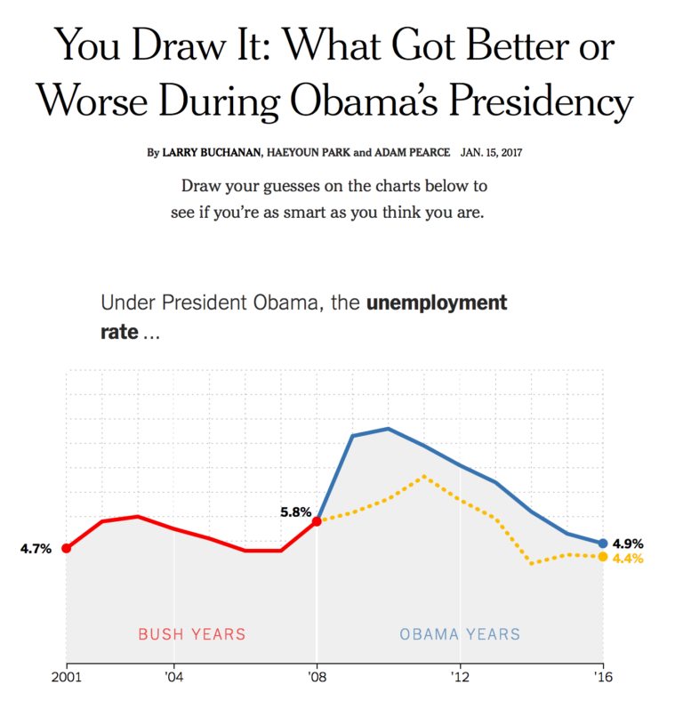
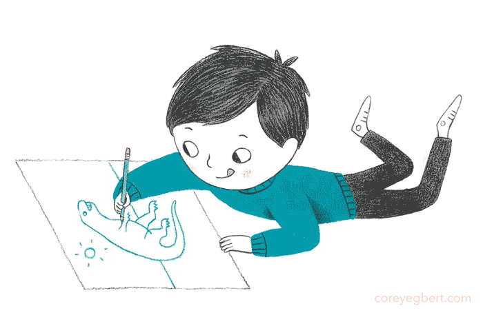

```{r, include = F, eval = T}
knitr::opts_chunk$set(echo = F, dpi = 300, message = F, warning = F, cache = T)
options(htmltools.dir.version = FALSE)
library(emo)
library(purrr)
library(tidyverse)
library(gridExtra)
library(nullabor)
library(scales)
library(knitr)
library(kableExtra)
library(RefManageR)
library(icons)
# download_fontawesome()
bib <- ReadBib("references.bib", check = FALSE)
ui <- "- "
options(knitr.kable.NA = '')
```

```{r, include = F, eval = T, cache = F}
clean_file_name <- function(x) {
  basename(x) %>% str_remove("\\..*?$") %>% str_remove_all("[^[A-z0-9_]]")
}
img_modal <- function(src, alt = "", id = clean_file_name(src), other = "") {
  
  other_arg <- paste0("'", as.character(other), "'") %>%
    paste(names(other), ., sep = "=") %>%
    paste(collapse = " ")
  
  js <- glue::glue("<script>
        /* Get the modal*/
          var modal{id} = document.getElementById('modal{id}');
        /* Get the image and insert it inside the modal - use its 'alt' text as a caption*/
          var img{id} = document.getElementById('img{id}');
          var modalImg{id} = document.getElementById('imgmodal{id}');
          var captionText{id} = document.getElementById('caption{id}');
          img{id}.onclick = function(){{
            modal{id}.style.display = 'block';
            modalImg{id}.src = this.src;
            captionText{id}.innerHTML = this.alt;
          }}
          /* When the user clicks on the modalImg, close it*/
          modalImg{id}.onclick = function() {{
            modal{id}.style.display = 'none';
          }}
</script>")
  
  html <- glue::glue(
     " <!-- Trigger the Modal -->

<!-- The Modal -->
<div id='modal{id}' class='modal'>
  <!-- Modal Content (The Image) -->
  
  <!-- Modal Caption (Image Text) -->
  <div id='caption{id}' class='modal-caption'></div>
</div>
"
  )
  write(js, file = "js-addins.html", append = T)
  return(html)
}
# Clean the file out at the start of the compilation
write("", file = "js-addins.html")
```

class:primary
## Outline

+ History of fitting lines by eye

+ You Draw It (NYTimes / with r2d3)

+ Getting Started with D3.js

+ r2d3 + R Shiny

+ Let's see how you do!

---
class:primary
## Subjective Judgment in Statistical Analysis: An Experimental Study (1951)
[(D. J. Finney; *Journal of the Royal Statistical Society*)](https://rss.onlinelibrary.wiley.com/doi/abs/10.1111/j.2517-6161.1951.tb00093.x)

.pull-left[
+ **Big Idea:** Determine the effect of stopping iterative maximum likelihood calculations after one iteration.
+ **Method:** Judge by eye the positions for a pair of *parallel* probit regression lines in a biological assay. Sent out by mail, asked to "rule two lines."
+ **Sample:** 21 scientists
+ **Findings:** One cycle of iteration was sufficient.
].pull-right[

]

???
+ The subjects for this study were deliberately chosen as. having no' experience of probit methods.

---
class:primary
## Scientistis have always had sass!
[(Subjective Judgment in Statistical Analysis: An Experimental Study; 1951; D. J. Finney; *Journal of the Royal Statistical Society*)](https://rss.onlinelibrary.wiley.com/doi/abs/10.1111/j.2517-6161.1951.tb00093.x)
<font size="3">
.small[
+ "No one in their right senses could draw 2 parallel lines through the points in question, but I've done my best to comply with your request as I understand it. **Certainly I did not use my intelligence**". (No. 2.)

+ "Where fact and theory are so at variance one guess is as good as another-so here goes. The job might have been easier if S.E. of individual points was known!" (No. 9.) 

+ "I should-say that the points were not on two parallel straight lines, and that was that!" (No. 11.) 
+ "The line through the x points is of course easy to draw. But I had to overcome considerable intellectual resistance before I could bring myself to draw a parallel line for the 0 points". (No. 14.) 

+ "**What fun! But I don't believe a word of it.** The only thing is either (a) to do the experiment again or (b) revise the theory". (No. 18.) 

+ **"If, as an experimental scientist, an experiment of mine produced a set of data such as you provided I should at once do the experiment again!"** (No. -20-a chemist.) 

+ "What I would really like to draw are 2 lines which are far from parallel!" (No. 21.)
]
</font>

---
class:primary
## Eye Fitting Straight Lines (1981)
[(Frederick Mosteller, Andrew F. Siegel, Edward Trapido & Cleo Youtz; *The American Statistician*)](https://www.tandfonline.com/doi/abs/10.1080/00031305.1981.10479335)

.pull-left[
+ **Big Idea:** Students fitted lines by eye to four sets of points.
+ **Method:** 8.5 x 11 inch transparency with a straight line etched completely across the
middle.
+ **Sample:** 153 graduate students and post docs in Introductory Biostatistics.
+ **Experimental Design:** Latin square with packets stapled in four different orders.
+ **Findings:** Students tended to fit the slope of the first principal component.
].pull-right[

]

???
+ Method involves maneuvering a string, black thread, or ruler until the fit seems satisfactory, and then drawing the line.
+ Sample - most had not studied statistics before
+ Method proposed by Tukey
+ Students tended to fit the slope of the first principal component or major axis (the line that minimizes the sum of squares of perpendicular rather than vertical distances).
+ Students had a slight tendency to choose consistently either steeper or shallower slopes for all sets of data.
+ Individual-to-individual variability in slope and in intercept was near the standard error provided by least squares for the four data sets (no theory encourages us to believe in such relations).
+ Found no trend in the differences due to order.

---
class:primary
## NYTimes You Draw It
.pull-left[

<font size="2">https://presentyourstory.com/ny-times-you-draw-it-charts/ </font>
].pull-right[
+ [Family Income affects college chances](https://www.nytimes.com/interactive/2015/05/28/upshot/you-draw-it-how-family-income-affects-childrens-college-chances.html)
+ [Just How Bad Is the Drug Overdose Epidemic?](https://www.nytimes.com/interactive/2017/04/14/upshot/drug-overdose-epidemic-you-draw-it.html)
+ [What Got Better or Worse During Obama’s Presidency](https://www.nytimes.com/interactive/2017/01/15/us/politics/you-draw-obama-legacy.html?_r=0)
]

---
class:primary
## You Draw It with `r2d3`
.pull-left[

].pull-right[

]

`r icons::fontawesome("github")` See [GitHub repository](https://github.com/srvanderplas/Perception-of-Log-Scales/tree/master/you-draw-it-development/you-draw-it-pilot-app) for shinydrawr-d3v5.js and R Shiny code.

---
class:primary
## Getting Started with D3.js

`D3.js` is to JavaScript as `ggplot2` is to R

.pull-left[
`r icons::fontawesome("js")` [Codecademy: Introduction to JavaScript](https://www.codecademy.com/learn/introduction-to-javascript)
`r icons::fontawesome("image")` Understand [SVG](http://tutorials.jenkov.com/svg/g-element.html) elements: inspect elements in web browser!
`r icons::fontawesome("book-open")` Amelia Wattenberger's [Full Stack D3 and Data Visualization Book](https://www.newline.co/fullstack-d3)
`r icons::fontawesome("chart-bar")` Build a basic graphic using [r2d3](https://rstudio.github.io/r2d3/articles/introduction.html)
`r icons::fontawesome("grimace")` Modify `D3.js` code until it does what you want!
]
.pull-right[
**Additional Resources**

`r icons::fontawesome("code")` [How to learn D3 with no coding experience](https://www.heshameissa.com/blog/learn-d3)
`r icons::fontawesome("file")` [Kiegan's ISU Graphics Group Presentation from Mar 25, 2021](https://kiegan.github.io/talks/graphics-group-r2d3/graphics-group-r2d3.html#1)
`r icons::fontawesome("twitter")` Amelia Wattenberger on [Twitter](https://twitter.com/Wattenberger)
]

---
class:primary
## r2d3 `r emo::ji("plus")` R Shiny

.center[

]
???
To distinguish between code that runs at initialization-time only and code that runs when data changes, organize your code so that the code which responds to data changes is contained within the r2d3.onRender()

An explicit resize handler redraws plot as you resize your browser window 

---
class:primary
## r2d3 `r emo::ji("plus")` R Shiny

```{r data_to_json, include = T, echo = T, eval = F}
data_to_json <- function(data) {
    jsonlite::toJSON(data, 
                     dataframe = "rows", 
                     auto_unbox = FALSE, 
                     rownames = TRUE)
} 
```

```{r r2d3, include = T, echo = T, eval = F}
data <- list(line_data, point_data) # Create a list of simulated point and line data
message_loc <- session$ns("drawr_message") # Create storage for data from d3.js
  r2d3(
    data = data_to_json(data), # Convert data list to a JSON file
    script = "shinydrawr-d3v5.js", # Provide the D3.js code file
    dependencies = c("d3-jetpack"),
    d3_version= "5", # Specify D3 version
    options = list(message_loc,
                   ...) # Communciate parameters from R Shiny to D3.js
  )
```

---
class:primary
## r2d3 `r emo::ji("plus")` R Shiny

```{r r2d3-draw-true-line, include = T, echo = T, eval = F}
function draw_true_line({svg, line_data, draw_start}, scales){
  var df = line_data.filter(function(d){ return d.x <= draw_start})
  state.svg.selectAppend("path.shown_line")
  .datum(df)
  .at(default_line_attrs)
  .attr("d", scales.line_drawer);
}
```

```{r r2d3-draw-points, include = T, echo = T, eval = F}
function draw_points({svg, point_data, points_end, points}, scales){
  const dots = state.svg.selectAll("circle").data(df)
  dots
    .enter().append("circle")
    .merge(dots)
    .attr("cx", d => scales.x(d.x))
    .attr("cy", d => scales.y(d.y))
    .attr("r", 2)
    .style("fill", "black")
    .style("opacity", 0.8)
    .style("stroke", "black")
}
```

---
class:primary
## r2d3 `r emo::ji("plus")` R Shiny

```{r r2d3-on-drag, include = T, echo = T, eval = F}
  const on_drag = function(){
    const drag_x = scales.x.invert(d3.event.x);
    const drag_y = scales.y.invert(d3.event.y);
    fill_in_closest_point(state, drag_x, drag_y);
    draw_user_line(state, scales);
    draw_rectangle(state, scales);
  };
```

```{r r2d3-on-end, include = T, echo = T, eval = F}
const on_end = function(){
    const line_status = get_user_line_status(state);
    if(line_status === 'done'){ # User has completed line drawing
      ...
      if(state.shiny_message_loc){ # Make sure shiny is available
        if(typeof Shiny !== 'undefined'){
          Shiny.onInputChange( # Send drawn points off to server
            state.shiny_message_loc,
            state.drawable_points.map(d => d.y)
          );
        ...
  };
```

---
class:primary
## r2d3 `r emo::ji("plus")` R Shiny

```{r r2d3-draw-watcher, include = T, echo = T, eval = F}
function setup_draw_watcher(svg, scales, on_drag, on_end){
  ...
  .call(
    d3.drag()
    .on("drag", on_drag)
    .on("end", on_end)
  );
}
```


---
class:primary
## Let's see how you do!

+ Visit https://shiny.srvanderplas.com/eye-fitting/ to participate.

+ Share your opinions and feedback as you're drawing!

.center[

]

???
https://emily-robinson.shinyapps.io/you-draw-it-pilot-app/

---
class:primary
## References
<font size="4">
.small[
+ Finney, D. J. (1951). Subjective judgment in statistical analysis: An experimental study. Journal of the Royal Statistical Society: Series B (Methodological), 13(2), 284-297.

+ Frederick Mosteller , Andrew F. Siegel , Edward Trapido & Cleo Youtz (1981) Eye Fitting Straight Lines, The American Statistician, 35:3, 150-152

+ NYTimes you draw it charts. (2017, January 16). Retrieved April 05, 2021, from https://presentyourstory.com/ny-times-you-draw-it-charts/
]
</font>

