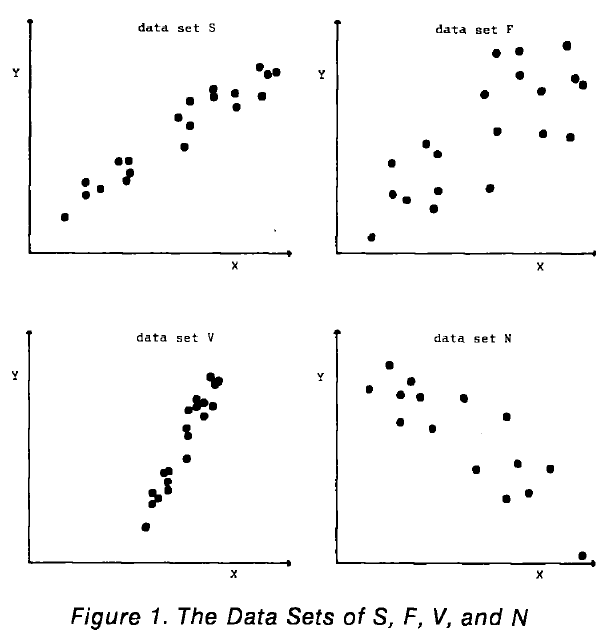

```{r setup, include=FALSE}
knitr::opts_chunk$set(
	echo = TRUE,
	message = FALSE,
	warning = FALSE
)
library(knitr)
library(tidyverse)
```

### Summary of [Eye Fitting Straight Lines](http://www.tandfonline.com/doi/abs/10.1080/00031305.1981.10479335)

-   Mosteller, F., Siegel, A. F., Trapido, E., & Youtz, C. (1981). Eye fitting straight lines. The American Statistician, 35(3), 150-152.

### Method/Procedure

-   Method involves maneuvering a string, black thread, or ruler until the fit seems satisfactory, and then drawing the line.

-   Students fitted lines by eye to four sets of points (S, F, V, N).

-   Sample: graduate students and post doc students in introductory biostatistics (most had not studied statistics before).

    -   laid out 175 packets, collected 153 at the end of the hour.
    -   Each student was given the same set of four scatter diagrams and an 8.5 x 11 inch transparency with a straight line etched completely across the middle.

### Parameters

 
{width="450"}

## Experimental Design

Latin square with packets stapeled in four different orders:

-   SNFV
-   NSVF
-   FVSN
-   VFNS

Distributed systematically in sequence so that students sitting side by side had different kinds of packets.

### Results

-   Students tended to fit the slope of the first principal component or major axis (the line that minimizes the sum of squares of perpendicular rather than vertical distances).
-   Students had a slight tendency to choose consistently either steeper or shallower slopes for all sets of data.
-   Individual-to-individual variability in slope and in intercept was near the standard error provided by least squares for the four data sets *(no theory ecourages us to beleive in such relations)*.
-   Found no trend in the differences due to order.

### Considerations for Eye Fitting Straight Lines in the Modern Era

-   You Draw It does not restrict participants to a straight line.
-   Does order matter?

```{r ydi-parameters}
ydi_parms <- data.frame(
           dataset = c("S", "F", "V", "N"),
           y_xbar = c(3.88, 3.9, 3.89, 4.11),
           slope  = c(0.66, 0.66, 1.98, -0.70),
           sigma  = c(1.3, 2.8, 1.5, 2.5),
           xmin   = c(0, 0, 5, 0),
           xmax   = c(20, 20, 15, 20)
           )
ydi_parms %>%
  kable(cap = "Simulation Parameters for 'You Draw it'")
```

```{r ydi-simfunc}
linearYDI_simFunc <- 
  function(y_xbar, slope, sigma, xmin = 0, xmax = 20, by = 0.25, N = 30, points_end_scale = 1){
    
  xLine <- seq(xmin, xmax, by = by)
  xPoint <- sample(xLine[xLine <= xmax*points_end_scale], size = N, replace = F)
  # From slope intercept form
  # y-y_xbar = m(x-xbar)
  # y = m(x-xbar) + y_xbar = mx - mxbar + y_xbar
  yintercept = y_xbar - slope*mean(xPoint)
    
  line_data <- tibble(x = xLine,
                      y = yintercept + slope*x)
  
  # generate point data
  repeat{
    errorVals <- rnorm(N, 0, sigma)
    if(mean(errorVals[10]) < 2*sigma & mean(errorVals[10] > -2*sigma)){
      break
    }
  }
  point_data <- tibble(x = xPoint,
                       ypoints = yintercept + slope*x + errorVals)
  
  data <- full_join(line_data, point_data, by = "x")%>%
      mutate(ypoints = ifelse(is.na(ypoints), -999, ypoints))
  
  # return(list(line_data = line_data, point_data = point_data, data = data))
  return(data)
    
}
```

```{r ydi-simulation}
ydi_data <- ydi_parms %>%
  mutate(data = purrr::pmap(list(y_xbar, slope, sigma, xmin, xmax), linearYDI_simFunc)) %>%
  unnest(data)

ydi_data %>%
  mutate(dataset = factor(dataset, levels = c("S", "F", "V", "N"))) %>%
  ggplot(aes(x = x, y = y)) +
  geom_line(color = "gray", linetype = 2) +
  geom_point(data = ydi_data %>% filter(ypoints != -999), aes(x = x, y = ypoints)) +
  theme_bw() +
  theme(aspect.ratio = 1) +
  facet_wrap(~dataset, ncol = 2, 
             labeller = labeller(dataset = label_both)) +
  scale_x_continuous(expand = c(0,0)) +
  scale_y_continuous(limits = c(min(ydi_data$y[ydi_data$dataset == "S"]), max(ydi_data$y[ydi_data$dataset == "S"])))
```

```{r lm}
lmFunc <- 
  function(B, dataset){

    coefs <- tibble()
    
    for(i in 1:B){
      ydi_data <- ydi_parms %>%
        filter(dataset == dataset) %>%
      mutate(data = purrr::pmap(list(y_xbar, slope, sigma, xmin, xmax), linearYDI_simFunc)) %>%
      unnest(data)
      
      lm.data <- ydi_data %>% filter(ypoints != -999)
      lm <- lm(ypoints ~ x, data = lm.data)
    
      coefs[i,"Intercept"] <- as.numeric(coef(lm)[1])
      coefs[i,"y_xbar"]    <- predict(lm, newdata = data.frame(x = mean(lm.data$x)))
      coefs[i,"Slope"]     <- as.numeric(coef(lm)[2])
    }

  mean <- apply(coefs, 2, mean)
  sd   <- apply(coefs, 2, sd)
  
  return(rbind(mean, sd))
  }
```

```{r lmFunc-eval, echo = F}
lmFunc(1000, "S") %>% kable(digits = 3, cap = "Dataset: S")
lmFunc(1000, "F") %>% kable(digits = 3, cap = "Dataset: F")
lmFunc(1000, "V") %>% kable(digits = 3, cap = "Dataset: V")
lmFunc(1000, "N") %>% kable(digits = 3, cap = "Dataset: N")
```
